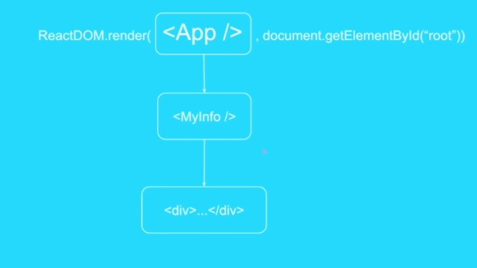

Introduction

Virtual DOM

- Model give data to UI and UI add that the Data to UI

```
{
    name:'Apple',
    color:'red'
}
<div>Apple</div>
<div>red</div>
```

Now if you have to update the name you have to write JS code to update the div which have 'name' value
and similarly, if you have to update 'color', you have keep track of div which contain 'color' value

- Similarly more the value in model, more the chances of model update. These update can be non-sequential. So, we have to keep track of all the elements which require update and have to do lot of expensive DOM manipulation. Result, low performance and lot of code to manage.

- **To avoid costly DOM manipulation or View Updates, React keep first snapshot of DOM/View. Whenever
  model updates -> view paints the whole information
  React compare the newly painted view with the Snapshot it have and just render the changes.
  This is Virtual DOM**

## Web-components

- Create reusable custom html elements
- Functional Components

## Setup

- Pre-requisite - ES6
- ```
   npm i react
   npm i react-dom
   npm i typescript -D
   npm i parcel-bundler -D
   npm i -D @types/react @types/react-dom
  ```
- package.json - (to run our bundler)

```javascript
"scripts": {
   "dev": "parcel src/index.html"
 }
```

# Folder structure


# index.html

```HTML
<!DOCTYPE html>
<html>
<head>
    <meta charset="utf-8" />
    <meta http-equiv="X-UA-Compatible" content="IE=edge">
    <title>React + TypeScript</title>
    <meta name="viewport" content="width=device-width, initial-scale=1">
</head>

<body>
    <div id="root"></div>
    <script src="./main.tsx"></script>
</body>
</html>
```

# main.tsx

```Typescript
import * as React from "react";
import * as ReactDom from "react-dom";

import HelloWorld from "./components/helloWorld";

ReactDom.render(<App/>,  document.getElementById('main'))

```

# App.tsx

```Typescript
import * as React from 'react';

export default class App extends React.Component {
    render(){
        return(<h1>Hello World! 🙏🏻</h1>)
    }
}
```



!important

- This is the Entry Point
- Adjacent JSX elements must be wrapped in an enclosing tag
- Ex.below code is not valid

```HTML
<!--Invalid-->
ReactDOM.render(<h1>1</h1><h2>2</h2>,
      document.getElementById('main'))
```
```HTML
<!--Valid-->
ReactDOM.render(
    <div>
      <h1>1</h1>
      <h2>2</h2>
    </div>
    , document.getElementById('main'))

```
```TypeScript
className=""
style={{color:#243ed, backgroundColor:'red'}}
```